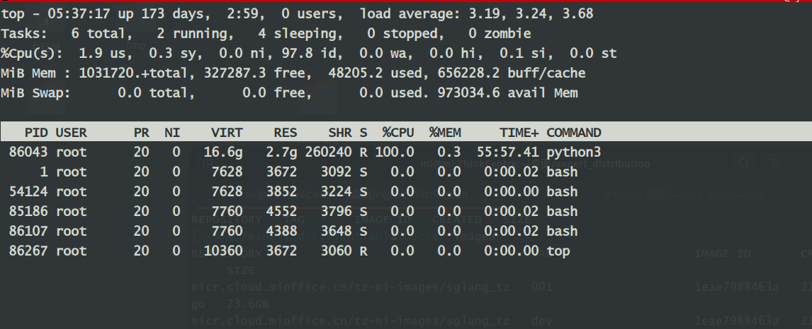
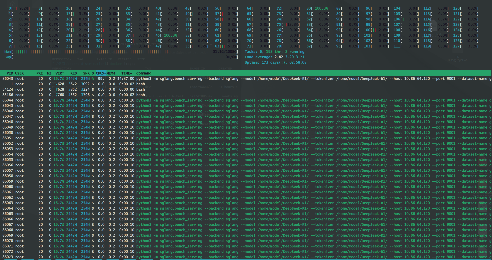
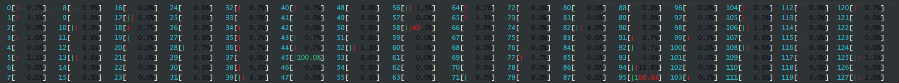
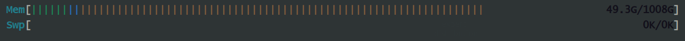
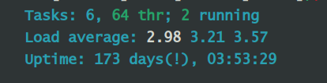
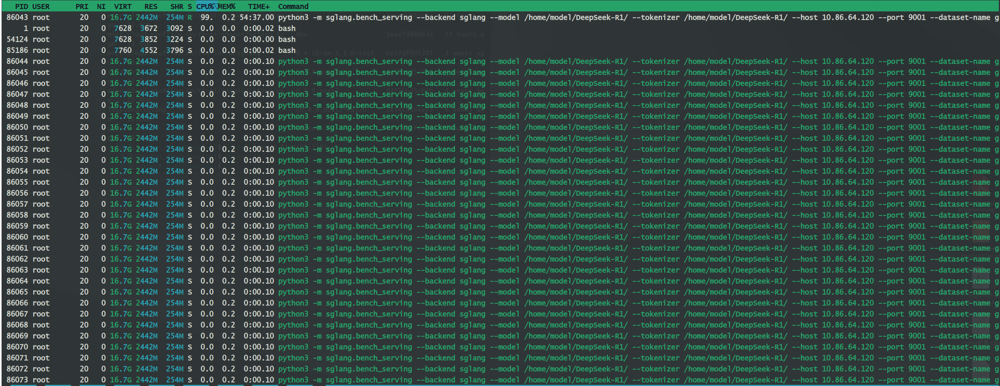

# ps

使用 `ps` 命令找出 `CPU` 占用高的进程:

`ps` 是 **进程状态** (`process status`) 的缩写，它能显示系统中活跃的/运行中的进程的信息, 包括用户名、用户ID、CPU 使用率、内存使用、进程启动日期时间、命令名等等。

```bash
ps -eo pid, ppid, %mem, %cpu, comm --sort=-%cpu | head
```
上面命令语句的各部分参数解释：
- `ps`：命令名字
- `-e`：选择所有进程
- `-o`：自定义输出格式
- `–sort=-%cpu`：基于 `CPU` 使用率对输出结果排序
- `head`：显示结果的前 10 行
- `PID`：进程的 `ID`
- `PPID`：父进程的 `ID`
- `%MEM`：进程使用的 `RAM` 比例
- `%CPU`：进程占用的 `CPU` 比例
- `Command`：进程名字


`ps` 和 `ps -e` 的区别：
- `ps`: 仅列出当前终端下、与你相同有效 `UID` 的进程。
- `ps -e`: 列出系统中每个进程，包括其他用户、后台守护进程等。
- `ps -f`: `-f` 参数表示 `full-format`，在输出中加入 `UID`、`PPID`、`C`（`CPU` 利用率调度权重）、`STIME`、`TTY`、`TIME` 等列。


# top & htop







## top

在 `Linux` 系统性能的监控工具中，`top` 命令提供了 `Linux` 系统运行中的进程的动态实时视图。它能显示系统的概览信息和 `Linux` 内核当前管理的进程列表。他显示了如 `CPU` 使用、内存使用、交换内存、运行的进程数、目前系统开机时间、系统负载、缓冲区大小、缓存大小、进程 `PID` 等等系统信息。

```bash 
top
```

- `PID`：进程的`ID`
- `USER`：进程所有者
- `PR`：进程的优先级别，越小越优先被执行
- `NInice`：值
- `VIRT`：进程占用的虚拟内存
- `RES`：进程占用的物理内存
- `SHR`：进程使用的共享内存
- `S`：进程的状态。`S` 表示休眠，`R` 表示正在运行，`Z` 表示僵死状态，`N` 表示该进程优先值为负数
- `%CPU`：进程占用 `CPU` 的使用率
- `%MEM`：进程使用的物理内存和总内存的百分比
- `TIME+`：该进程启动后占用的总的 `CPU` 时间，即占用 `CPU` 使用时间的累加值。
- `COMMAND`：进程启动命令名称

## htop
安装：
```bash
apt install htop
```

可以使用 `htop -h` 查看帮助，常用命令有：
```bash
htop

# 显示指定PID的进程
htop -p 123,456,789

# 设置进程刷新的时间间隔, 设置间隔为1秒，即10/10
htop -d 10


# 显示成树形结构
htop -t
```


### cpu使用情况

- `0-127`，代表 `CPU` 的核心编号
- `CPU` 的色彩编码：
  - `Green`：用户进程所消耗的 `CPU` 量。
  - `Red`：系统进程所消耗的 `CPU` 量。
  - `Grey`：用于基于输入/输出的进程的 `CPU` 数量。
  - `Blue`：低优先级进程消耗的 `CPU` 数量。

### 内存使用情况

- `Mem` ：内存使用量
- `Swp` ：交换内存使用量
  - `Green`：用于运行系统中进程的RAM百分比。
  - `Blue`：缓冲区页面消耗的RAM百分比。
  - `Orange/Yellow`：用于缓存内存的RAM百分比。

### 任务使用情况

- `Tasks: 6, 64thr；2 running`：表示当前有6个任务/进程数，并且这些进程由64个线程（`thr`）处理，没有涉及到内核线程（`kthr`），在6个进程中，只有两个处于运行状态（`running`）
- `Load average: 2.98 3.21 3.57`：这是一个128核系统，所以最大负载量为128.0；2.98表示最近一分钟的平均负载；3.21代表最近5分钟的平均负载；3.57代表最近15分钟的平均负载。
- `Uptime` 表示自上次系统重启以来的时间长度。

### 进程使用情况

- `PID` (`Process ID`) ：进程`id`。
- `USER` ：进程所有者。
- `PRI` (`Priority`)：内核对进程的优先级。
- `NI` (`Nice Value`)：用户查看的进程优先级，`nice`值越高，优先级越低。
- `VIRT` (`Virtual Memory`)：进程消耗的虚拟内存量。
- `RES` (`Resident Memory`)：进程正在使用的 `RAM` 的比例。
- `SHR` (`Shared Memory`)：任务占用的共享内存量。
- `S` (`Status`)：进程状态，**S**(休眠), **R**(运行中)。
- `CPU%`：进程消耗的 `CPU` 百分比。
- `MEM%`：进程消耗的内存百分比。
- `TIME+`：进程持续的时间。
- `Command`：包含程序名称和参数的进程的完整命令。

### 自定义设置


