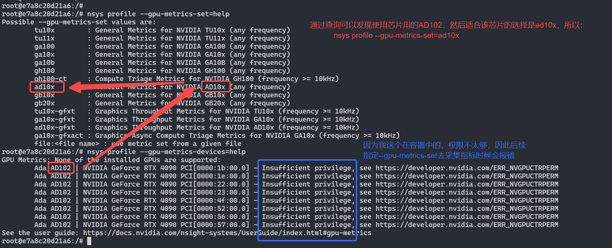
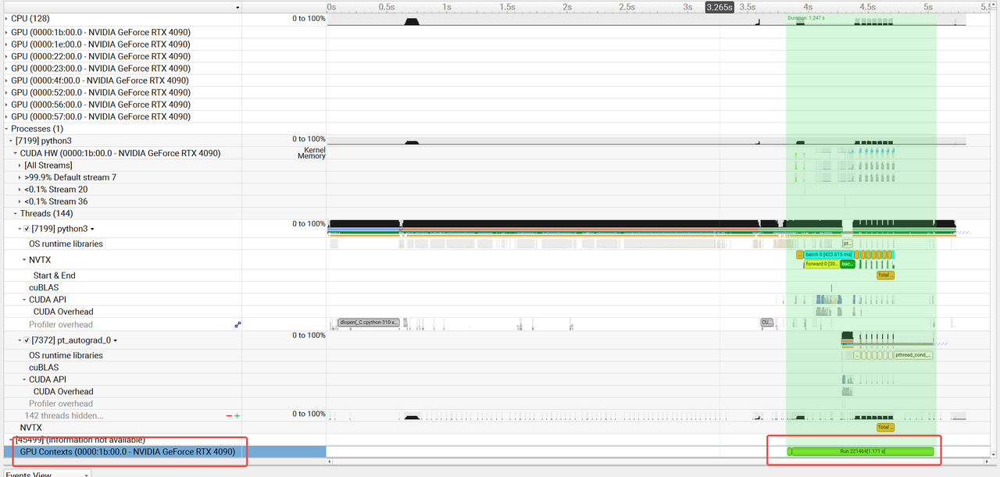
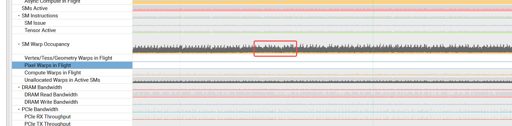
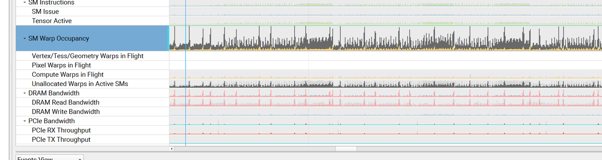
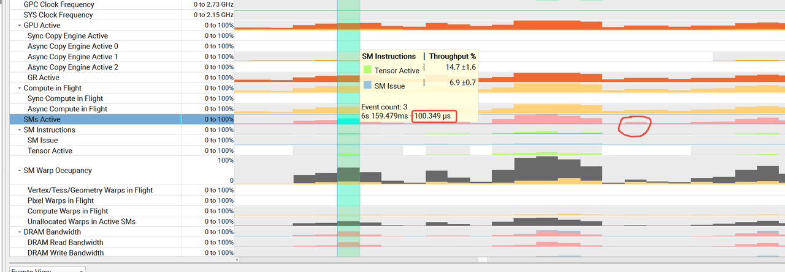
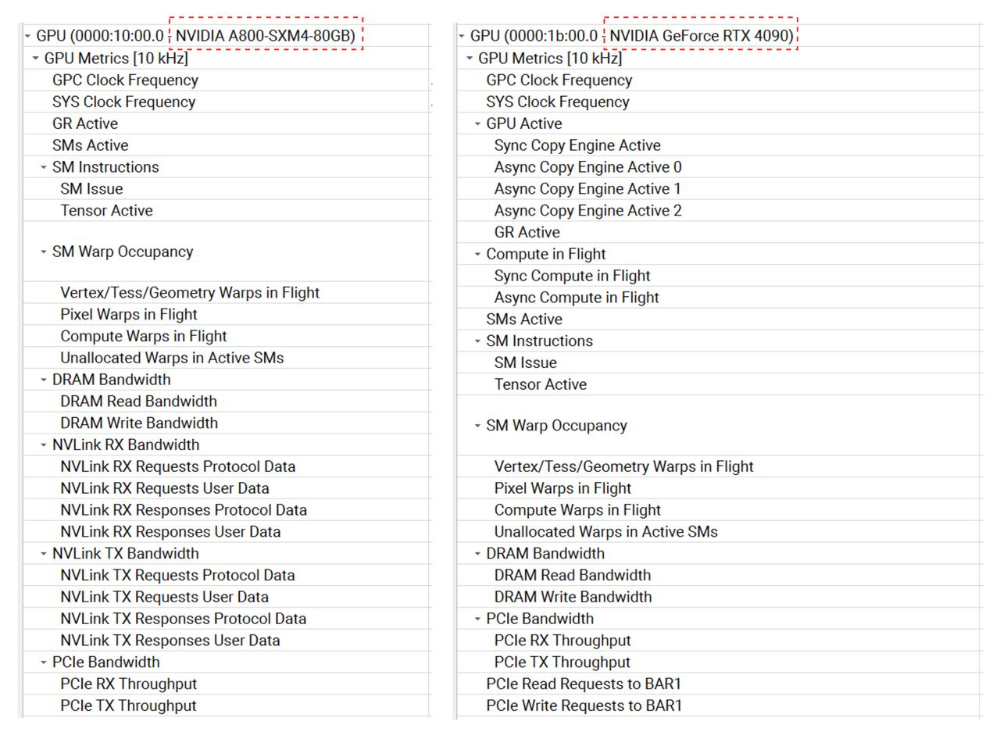
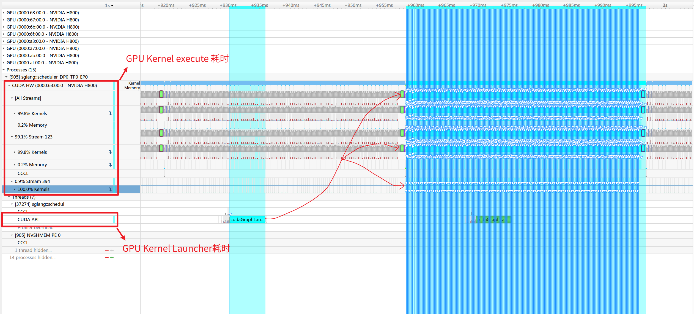


这个主要是对训练/推理过程中，可视化`GPU`性能的分析工具使用说明，注意在容器中需要权限去访问底层硬件，所以一般需要提供 `CAP_SYS_ADMIN/SYS_ADMIN` 权限，或者说`--privileged`权限。



# NVML & DCGM

`NVIDIA GPU` 上存在一些**硬件计数器**，这些计数器可以用来收集一些**设备级别** (硬件采集支持) 的性能指标，例如 `GPU` 利用率、显存使用情况等。通过 `NVIDIA`提供的`NVML`（`NVIDIA Management Library`）库或 `DCGM`（`Data Center GPU Manager`）工具能够查询和采集硬件层提供的这些指标。

- [NVML](https://developer.nvidia.com/management-library-nvml)：这是一个基于 `C` 的编程接口，用于监控和管理数据中心 `GPU` 中的各种状态。这也是 `NVIDIA` 支持 `nvidia-smi` 工具的底层库，`nvidia-smi`命令会随着驱动的安装而存在。`NVML` 是线程安全的，因此可以多个线程同时对 `NVML` 进行调用。
- [DCGM](https://developer.nvidia.com/dcgm)：`DCGM`是一套用于在集群环境中管理和监控数据中心的 `NVIDIA GPU` 工具，旨在管理和轻松监控数据中心 `GPU` 资源的运行状况、性能和利用率。
  - 使用：首先在有 `NVIDIA GPU` 服务器的节点上安装 `DCGM`(核心是 `libdcgm.so` 库)，然后可通过 `HostEngine` 启动服务或将`HostEngine`作为嵌入式进程启动（集成`libdcgm.so`库）。服务启动后，`DCGM` 提供两种用户交互的界面：`dcgmi`(命令行交互) 和 `DCGM Exporter`（为原生 `Kubernetes` 环境中的集群级监控定制）。
  - 根据[How to get the module profile loaded? · Issue #132 · NVIDIA/DCGM](https://github.com/NVIDIA/DCGM/issues/132)提示：性能分析模块`DCGM` 中的 `Profiling` 模块对 `RTX/GTX GPU` 类卡并不支持，即在消费级显卡 `RTX 4090` 上一些指标数据无法通过 `DCGM Exporter`采集到（如 `SM issue` 无法通过 `DCGM` 采集到，但是可以通过 `NVML` 获取）。

## nvidia-smi

### 常用命令

所有的使用可通过 `nvidia-smi -h` 查看帮助，这里介绍一些比较常用命令：
```bash
# 基础信息查询命令
nvidia-smi        # 显示GPU总览信息，如GPU列表、温度、功耗、内存使用信息
nvidia-smi -L     # 列出所有GPU设备，如 GPU UUID和名称列表
nvidia-smi -h     # 显示帮助信息，包含所有可用命令选项
nvidia-smi -i 0   # 查询指定GPU信息，显示查询的单个GPU详细状态
nvidia-smi -q     # 查询详细GPU信息，包含完整GPU配置和状态

# 实时监控命令
nvidia-smi -l 1             # -l [秒数]：循环间隔，这里表示每秒循环显示信息。
nvidia-smi dmon --help      # 简洁模式下的配置说明
nvidia-smi dmon             # 以简洁格式实时显示设备监控模式数据
nvidia-smi dmon -s pucvmet  # [-s | --select]，指定监控指标： p:功耗 u:利用率 c:时钟 v:温度 m:内存 e:编码器 t:时间1
nvidia-smi dmon --gpm-metrics=2,3,4,5,10,11,12,13       # 这些数字可以通过 nvidia-smi dmon --help 查看
nvidia-smi dmon -c 100      # -c [次数]：指定限制监控的次数，这里设置监控 100 次后退出

# 详细查询命令
nvidia-smi -q -d MEMORY       # 查询内存详细信息，如内存使用、BAR1、ECC状态
nvidia-smi -q -d PERFORMANCE  # 查询性能状，如P-State、时钟频率、性能模式
nvidia-smi -q -d SUPPORTED_CLOCKS   # 查询支持的时钟频率，返回所有可用时钟设置
nvidia-smi -q -d POWER        # 查询功耗详细信息	功耗限制、当前功耗、电压
nvidia-smi -q -d CLOCK        # 查询当前时钟信息	GPU、内存、视频时钟频率

# 拓扑和连接命令
nvidia-smi topo --help  # 显示帮助
nvidia-smi topo -m      # 显示GPU拓扑矩阵，包括GPU间连接关系和NUMA亲和性（这个NUMA是CPU相关的）
nvidia-smi topo -p      # 显示PCIe拓扑	仅PCIe连接（排除NVLink）
nvidia-smi nvlink --status      # NVLink状态查询，包括NVLink连接状态和错误
nvidia-smi nvlink -i 0 --status # 指定GPU的NVLink状态，显示单GPU所有NVLink状态
nvidia-smi nvlink -i 0 -l 0 --status  # 指定NVLink通道状态，只显示特定通道详细状态

# 进程和应用监控命令
nvidia-smi pmon --help  # 显示进程监控模式下的设置帮助
nvidia-smi pmon         # 进程监控模式，用于显示各进程GPU使用情况，对多进程GPU资源分析
nvidia-smi pmon -c 50   # 限制进程监控次数，这里设置监控50次进程状态
nvidia-smi --help-query-compute-apps # 查询--query-compute-apps的有效属性显示
nvidia-smi --query-compute-apps=pid,process_name,gpu_uuid,gpu_name,used_memory --format=csv # 查询计算应用详情,并以CSV格式的应用信息	自动化脚本和报告
nvidia-smi --help-query-accounted-apps # 查询--query-accounted-apps的有效属性显示
nvidia-smi --query-accounted-apps=pid,gpu_util,mem_util,max_memory_usage,time --format=csv  # 查询应用账户信息，包括应用资源使用的统计	

# 自定义查询命令
nvidia-smi --help-query-gpu # 查询自定义查询命令nvidia-smi --query-gpu=支持的属性 
nvidia-smi --query-gpu=gpu_name,driver_version,memory.total,memory.used --format=csv  # 自定义GPU信息查询，以CSV格式输出
nvidia-smi --query-gpu=temperature.gpu,power.draw,utilization.gpu,utilization.memory --format=csv,noheader,nounits  # 纯数值输出	无表头无单位的数值
nvidia-smi --query-gpu=clocks.current.graphics,clocks.current.sm,clocks.current.memory,clocks.current.video --format=csv  # 时钟频率查询，显示各种时钟频率信息，可用于性能状态监控
```
### 命令详解

```bash
> nvidia-smi

+-----------------------------------------------------------------------------------------+
| NVIDIA-SMI 570.124.06             Driver Version: 570.124.06     CUDA Version: 12.8     |
|-----------------------------------------+------------------------+----------------------+
| GPU  Name                 Persistence-M | Bus-Id          Disp.A | Volatile Uncorr. ECC |
| Fan  Temp   Perf          Pwr:Usage/Cap |           Memory-Usage | GPU-Util  Compute M. |
|                                         |                        |               MIG M. |
|=========================================+========================+======================|
|   0  NVIDIA H800                    On  |   00000000:63:00.0 Off |                    0 |
| N/A   37C    P0            140W /  700W |   56073MiB /  81559MiB |     52%      Default |
|                                         |                        |             Disabled |
+-----------------------------------------+------------------------+----------------------+
|   1  NVIDIA H800                    On  |   00000000:67:00.0 Off |                    0 |
| N/A   40C    P0            138W /  700W |   56121MiB /  81559MiB |     64%      Default |
|                                         |                        |             Disabled |
+-----------------------------------------+------------------------+----------------------+
|   2  NVIDIA H800                    On  |   00000000:6B:00.0 Off |                    0 |
| N/A   42C    P0            152W /  700W |   56075MiB /  81559MiB |     45%      Default |
|                                         |                        |             Disabled |
+-----------------------------------------+------------------------+----------------------+
|   3  NVIDIA H800                    On  |   00000000:6F:00.0 Off |                    0 |
| N/A   37C    P0            144W /  700W |   56121MiB /  81559MiB |     58%      Default |
|                                         |                        |             Disabled |
+-----------------------------------------+------------------------+----------------------+
|   4  NVIDIA H800                    On  |   00000000:A3:00.0 Off |                    0 |
| N/A   38C    P0            152W /  700W |   56073MiB /  81559MiB |     36%      Default |
|                                         |                        |             Disabled |
+-----------------------------------------+------------------------+----------------------+
|   5  NVIDIA H800                    On  |   00000000:A7:00.0 Off |                    0 |
| N/A   44C    P0            154W /  700W |   56121MiB /  81559MiB |     62%      Default |
|                                         |                        |             Disabled |
+-----------------------------------------+------------------------+----------------------+
|   6  NVIDIA H800                    On  |   00000000:AB:00.0 Off |                    0 |
| N/A   43C    P0            158W /  700W |   56073MiB /  81559MiB |     53%      Default |
|                                         |                        |             Disabled |
+-----------------------------------------+------------------------+----------------------+
|   7  NVIDIA H800                    On  |   00000000:AF:00.0 Off |                    0 |
| N/A   38C    P0            153W /  700W |   56123MiB /  81559MiB |     46%      Default |
|                                         |                        |             Disabled |
+-----------------------------------------+------------------------+----------------------+
                                                                                         
+-----------------------------------------------------------------------------------------+
| Processes:                                                                              |
|  GPU   GI   CI              PID   Type   Process name                        GPU Memory |
|        ID   ID                                                               Usage      |
|=========================================================================================|
|    0   N/A  N/A             731      C   sglang::scheduler_DP0_TP0_EP0         56054MiB |
|    1   N/A  N/A             732      C   sglang::scheduler_DP1_TP1_EP1         56102MiB |
|    2   N/A  N/A             733      C   sglang::scheduler_DP2_TP2_EP2         56056MiB |
|    3   N/A  N/A             734      C   sglang::scheduler_DP3_TP3_EP3         56102MiB |
|    4   N/A  N/A             735      C   sglang::scheduler_DP4_TP4_EP4         56054MiB |
|    5   N/A  N/A             736      C   sglang::scheduler_DP5_TP5_EP5         56102MiB |
|    6   N/A  N/A             737      C   sglang::scheduler_DP6_TP6_EP6         56054MiB |
|    7   N/A  N/A             738      C   sglang::scheduler_DP7_TP7_EP7         56104MiB |
+-----------------------------------------------------------------------------------------+

```

```bash
# 查询使用，不同版本内容可能不一样
> nvidia-smi dmon --help

    GPU statistics are displayed in scrolling format with one line
    per sampling interval. Metrics to be monitored can be adjusted
    based on the width of terminal window. Monitoring is limited to
    a maximum of 4 devices. If no devices are specified, then up to
    first 4 supported devices under natural enumeration (starting
    with GPU index 0) are used for monitoring purpose.
    It is supported on Tesla, GRID, Quadro and limited GeForce products
    for Kepler or newer GPUs under x64 and ppc64 bare metal Linux.
    Note: On MIG-enabled GPUs, querying the utilization of encoder,
    decoder, jpeg, ofa, gpu, and memory is not currently supported.

    Usage: nvidia-smi dmon [options]

    Options include:
    [-i | --id]:          Comma separated Enumeration index, PCI bus ID or UUID
    [-d | --delay]:       Collection delay/interval in seconds [default=1sec]
    [-c | --count]:       Collect specified number of samples and exit
    [-s | --select]:      One or more metrics [default=puc]
                          Can be any of the following:
                              p - Power Usage and Temperature
                              u - Utilization
                              c - Proc and Mem Clocks
                              v - Power and Thermal Violations
                              m - FB and Bar1 Memory
                              e - ECC Errors and PCIe Replay errors
                              t - PCIe Rx and Tx Throughput
    [N/A | --gpm-metrics]: Comma-separated list of GPM metrics to watch
                           Available metrics:
                               Graphics Activity    = 1
                               SM Activity          = 2
                               SM Occupancy         = 3
                               Integer Activity     = 4
                               Tensor Activity      = 5
                               DFMA Tensor Activity = 6
                               HMMA Tensor Activity = 7
                               IMMA Tensor Activity = 9
                               DRAM Activity        = 10
                               FP64 Activity        = 11
                               FP32 Activity        = 12
                               FP16 Activity        = 13
                               PCIe TX              = 20
                               PCIe RX              = 21
                               NVDEC 0-7 Activity   = 30-37
                               NVJPG 0-7 Activity   = 40-47
                               NVOFA 0 Activity     = 50
                               NVLink Total RX      = 60
                               NVLink Total TX      = 61
                               NVLink L0-17 RX      = 62, 64, 66, ..., 96
                               NVLink L0-17 TX      = 63, 65, 67, ..., 97

    [-o | --options]:     One or more from the following:
                              D - Include Date (YYYYMMDD) in scrolling output
                              T - Include Time (HH:MM:SS) in scrolling output
    [-f | --filename]:    Log to a specified file, rather than to stdout
    [-h | --help]:        Display help information


# 查询 Graphics Activity（1）、SM Activity（2）、SM Occupancy（3）、 Integer Activity（4）、Tensor Activity（5）、DRAM Activity（10）、FP64 Activity（11）、FP32 Activity（12）、FP16 Activity（13）、PCIe TX（20）、PCIe RX（21）、NVLink Total RX（60）、NVLink Total TX（61） 数据
> nvidia-smi dmon --gpm-metrics=1,2,3,4,5,10,11,12,13,20,21,60,61

# gpu    pwr  gtemp  mtemp     sm    mem    enc    dec    jpg    ofa   mclk   pclk      gract    smutil     smocc   intutil    mmaact      dram      fp64      fp32      fp16     pcitx     pcirx     nvlrx     nvltx
# Idx      W      C      C      %      %      %      %      %      %    MHz    MHz      GPM:%     GPM:%     GPM:%     GPM:%     GPM:%     GPM:%     GPM:%     GPM:%     GPM:% GPM:MiB/s GPM:MiB/s GPM:MiB/s GPM:MiB/s
    0     56     30     28      0      0      0      0      0      0   1593    210          -         -         -         -         -         -         -         -         -         -         -         -         -
    1     55     29     27      0      0      0      0      0      0   1593    210          0         0         0         0         0         0         0         0         0         0         0         0         0
    2     54     29     28      0      0      0      0      0      0   1593    210          0         0         0         0         0         0         0         0         0         0         0         0         0
    3     57     30     27      0      0      0      0      0      0   1593    210          0         0         0         0         0         0         0         0         0         0         0         0         0
    4     55     29     28      0      0      0      0      0      0   1593    210          0         0         0         0         0         0         0         0         0         0         0         0         0
    5     54     29     27      0      0      0      0      0      0   1593    210          0         0         0         0         0         0         0         0         0         0         0         0         0
    6     56     29     27      0      0      0      0      0      0   1593    210          0         0         0         0         0         0         0         0         0         0         0         0         0
    7     54     30     28      0      0      0      0      0      0   1593    210          0         0         0         0         0         0         0         0         0         0         0         0         0
```


```bash
# 查看GPU网络拓扑
> nvidia-smi topo -mp

        GPU0    GPU1    GPU2    GPU3    GPU4    GPU5    GPU6    GPU7    NIC0    NIC1    NIC2    NIC3    NIC4    NIC5    CPU Affinity    NUMA Affinity   GPU NUMA ID
GPU0     X      PXB     NODE    NODE    SYS     SYS     SYS     SYS     PXB     NODE    NODE    NODE    SYS     SYS     0-31,64-95      0               N/A
GPU1    PXB      X      NODE    NODE    SYS     SYS     SYS     SYS     PXB     NODE    NODE    NODE    SYS     SYS     0-31,64-95      0               N/A
GPU2    NODE    NODE     X      PXB     SYS     SYS     SYS     SYS     NODE    PXB     PXB     PXB     SYS     SYS     0-31,64-95      0               N/A
GPU3    NODE    NODE    PXB      X      SYS     SYS     SYS     SYS     NODE    PXB     PXB     PXB     SYS     SYS     0-31,64-95      0               N/A
GPU4    SYS     SYS     SYS     SYS      X      PXB     NODE    NODE    SYS     SYS     SYS     SYS     PXB     NODE    32-63,96-127    1               N/A
GPU5    SYS     SYS     SYS     SYS     PXB      X      NODE    NODE    SYS     SYS     SYS     SYS     PXB     NODE    32-63,96-127    1               N/A
GPU6    SYS     SYS     SYS     SYS     NODE    NODE     X      PXB     SYS     SYS     SYS     SYS     NODE    PXB     32-63,96-127    1               N/A
GPU7    SYS     SYS     SYS     SYS     NODE    NODE    PXB      X      SYS     SYS     SYS     SYS     NODE    PXB     32-63,96-127    1               N/A
NIC0    PXB     PXB     NODE    NODE    SYS     SYS     SYS     SYS      X      NODE    NODE    NODE    SYS     SYS
NIC1    NODE    NODE    PXB     PXB     SYS     SYS     SYS     SYS     NODE     X      PIX     PIX     SYS     SYS
NIC2    NODE    NODE    PXB     PXB     SYS     SYS     SYS     SYS     NODE    PIX      X      PIX     SYS     SYS
NIC3    NODE    NODE    PXB     PXB     SYS     SYS     SYS     SYS     NODE    PIX     PIX      X      SYS     SYS
NIC4    SYS     SYS     SYS     SYS     PXB     PXB     NODE    NODE    SYS     SYS     SYS     SYS      X      NODE
NIC5    SYS     SYS     SYS     SYS     NODE    NODE    PXB     PXB     SYS     SYS     SYS     SYS     NODE     X

Legend:

  X    = Self
  SYS  = Connection traversing PCIe as well as the SMP interconnect between NUMA nodes (e.g., QPI/UPI)
  NODE = Connection traversing PCIe as well as the interconnect between PCIe Host Bridges within a NUMA node
  PHB  = Connection traversing PCIe as well as a PCIe Host Bridge (typically the CPU)
  PXB  = Connection traversing multiple PCIe bridges (without traversing the PCIe Host Bridge)
  PIX  = Connection traversing at most a single PCIe bridge

NIC Legend:

  NIC0: mlx5_0
  NIC1: mlx5_1
  NIC2: mlx5_2
  NIC3: mlx5_3
  NIC4: mlx5_4
  NIC5: mlx5_5

# 检查Mellanox网卡是否安装 以及 安装版本
> lspci | grep Mellanox

1d:00.0 Infiniband controller: Mellanox Technologies MT28908 Family [ConnectX-6]
5d:00.0 Infiniband controller: Mellanox Technologies MT28908 Family [ConnectX-6]
5e:00.0 Ethernet controller: Mellanox Technologies MT27800 Family [ConnectX-5]
5e:00.1 Ethernet controller: Mellanox Technologies MT27800 Family [ConnectX-5]
96:00.0 Infiniband controller: Mellanox Technologies MT28908 Family [ConnectX-6]
cd:00.0 Infiniband controller: Mellanox Technologies MT28908 Family [ConnectX-6]

# 查看网口映射关系
> ibdev2netdev

mlx5_0 port 1 ==> ib0 (Down)
mlx5_1 port 1 ==> ib1 (Down)
mlx5_2 port 1 ==> eth0 (Up)
mlx5_3 port 1 ==> eth1 (Down)
mlx5_4 port 1 ==> ib2 (Down)
mlx5_5 port 1 ==> ib3 (Down)


# 显示 InfiniBand 网络设备运行状态
> ibstat

CA 'mlx5_0'
        CA type: MT4123
        Number of ports: 1
        Firmware version: 20.35.3006
        Hardware version: 0
        Node GUID: 0x946dae0300d52e8a
        System image GUID: 0x946dae0300d52e8a
        Port 1:
                State: Active
                Physical state: LinkUp
                Rate: 200
                Base lid: 283
                LMC: 0
                SM lid: 1
                Capability mask: 0xa651e848
                Port GUID: 0x946dae0300d52e8a
                Link layer: InfiniBand
CA 'mlx5_1'
        CA type: MT4123
        Number of ports: 1
        Firmware version: 20.35.3006
        Hardware version: 0
        Node GUID: 0x946dae0300d51eda
        System image GUID: 0x946dae0300d51eda
        Port 1:
                State: Active
                Physical state: LinkUp
                Rate: 200
                Base lid: 282
                LMC: 0
                SM lid: 1
                Capability mask: 0xa651e848
                Port GUID: 0x946dae0300d51eda
                Link layer: InfiniBand
CA 'mlx5_2'
        CA type: MT4119
        Number of ports: 1
        Firmware version: 16.32.1010
        Hardware version: 0
        Node GUID: 0xe8ebd3030073d504
        System image GUID: 0xe8ebd3030073d504
        Port 1:
                State: Active
                Physical state: LinkUp
                Rate: 25
                Base lid: 0
                LMC: 0
                SM lid: 0
                Capability mask: 0x00010000
                Port GUID: 0xeaebd3fffe73d504
                Link layer: Ethernet
CA 'mlx5_3'
        CA type: MT4119
        Number of ports: 1
        Firmware version: 16.32.1010
        Hardware version: 0
        Node GUID: 0xe8ebd3030073d505
        System image GUID: 0xe8ebd3030073d504
        Port 1:
                State: Down
                Physical state: Disabled
                Rate: 40
                Base lid: 0
                LMC: 0
                SM lid: 0
                Capability mask: 0x00010000
                Port GUID: 0xeaebd3fffe73d505
                Link layer: Ethernet
CA 'mlx5_4'
        CA type: MT4123
        Number of ports: 1
        Firmware version: 20.35.3006
        Hardware version: 0
        Node GUID: 0x946dae0300d52f06
        System image GUID: 0x946dae0300d52f06
        Port 1:
                State: Active
                Physical state: LinkUp
                Rate: 200
                Base lid: 285
                LMC: 0
                SM lid: 1
                Capability mask: 0xa651e848
                Port GUID: 0x946dae0300d52f06
                Link layer: InfiniBand
CA 'mlx5_5'
        CA type: MT4123
        Number of ports: 1
        Firmware version: 20.35.3006
        Hardware version: 0
        Node GUID: 0x946dae0300d539b2
        System image GUID: 0x946dae0300d539b2
        Port 1:
                State: Active
                Physical state: LinkUp
                Rate: 200
                Base lid: 284
                LMC: 0
                SM lid: 1
                Capability mask: 0xa651e848
                Port GUID: 0x946dae0300d539b2
                Link layer: InfiniBand
```

```bash
       GPU0    GPU1   GPU2   GPU3   GPU4   GPU5   GPU6   GPU7   NIC0   NIC1   NIC2   NIC3   NIC4   NIC5   NIC6   NIC7   NIC8   NIC9   CPU Affinity    NUMA Affinity    GPU NUMA ID
GPU0     X     PHB    PHB    PHB    SYS    SYS    SYS    SYS    SYS    PIX    PHB    PHB    PHB    SYS    SYS    SYS    SYS    SYS      0-53    0          N/A
GPU1    PHB     X     PHB    PHB    SYS    SYS    SYS    SYS    SYS    PHB    PIX    PHB    PHB    SYS    SYS    SYS    SYS    SYS      0-53    0          N/A
GPU2    PHB    PHB     X     PHB    SYS    SYS    SYS    SYS    SYS    PHB    PHB    PIX    PHB    SYS    SYS    SYS    SYS    SYS      0-53    0          N/A
GPU3    PHB    PHB    PHB     X     SYS    SYS    SYS    SYS    SYS    PHB    PHB    PHB    PIX    SYS    SYS    SYS    SYS    SYS      0-53    0          N/A
GPU4    SYS    SYS    SYS    SYS     X     PHB    PHB    PHB    SYS    SYS    SYS    SYS    SYS    PIX    PHB    PHB    PHB    SYS      54-107  1          N/A
GPU5    SYS    SYS    SYS    SYS    PHB     X     PHB    PHB    SYS    SYS    SYS    SYS    SYS    PHB    PIX    PHB    PHB    SYS      54-107  1          N/A
GPU6    SYS    SYS    SYS    SYS    PHB    PHB     X     PHB    SYS    SYS    SYS    SYS    SYS    PHB    PHB    PIX    PHB    SYS      54-107  1          N/A
GPU7    SYS    SYS    SYS    SYS    PHB    PHB    PHB     X     SYS    SYS    SYS    SYS    SYS    PHB    PHB    PHB    PIX    SYS      54-107  1          N/A
NIC0    SYS    SYS    SYS    SYS    SYS    SYS    SYS    SYS     X     SYS    SYS    SYS    SYS    SYS    SYS    SYS    SYS    SYS
NIC1    PIX    PHB    PHB    PHB    SYS    SYS    SYS    SYS    SYS     X     PHB    PHB    PHB    SYS    SYS    SYS    SYS    SYS
NIC2    PHB    PIX    PHB    PHB    SYS    SYS    SYS    SYS    SYS    PHB     X     PHB    PHB    SYS    SYS    SYS    SYS    SYS
NIC3    PHB    PHB    PIX    PHB    SYS    SYS    SYS    SYS    SYS    PHB    PHB     X     PHB    SYS    SYS    SYS    SYS    SYS
NIC4    PHB    PHB    PHB    PIX    SYS    SYS    SYS    SYS    SYS    PHB    PHB    PHB     X     SYS    SYS    SYS    SYS    SYS
NIC5    SYS    SYS    SYS    SYS    PIX    PHB    PHB    PHB    SYS    SYS    SYS    SYS    SYS     X     PHB    PHB    PHB    SYS
NIC6    SYS    SYS    SYS    SYS    PHB    PIX    PHB    PHB    SYS    SYS    SYS    SYS    SYS    PHB     X     PHB    PHB    SYS
NIC7    SYS    SYS    SYS    SYS    PHB    PHB    PIX    PHB    SYS    SYS    SYS    SYS    SYS    PHB    PHB     X     PHB    SYS
NIC8    SYS    SYS    SYS    SYS    PHB    PHB    PHB    PIX    SYS    SYS    SYS    SYS    SYS    PHB    PHB    PHB     X     SYS
NIC9    SYS    SYS    SYS    SYS    SYS    SYS    SYS    SYS    SYS    SYS    SYS    SYS    SYS    SYS    SYS    SYS    SYS     X

Legend:

  X    = Self
  SYS  = Connection traversing PCIe as well as the SMP interconnect between NUMA nodes (e.g., QPI/UPI)
  NODE = Connection traversing PCIe as well as the interconnect between PCIe Host Bridges within a NUMA node
  PHB  = Connection traversing PCIe as well as a PCIe Host Bridge (typically the CPU)
  PXB  = Connection traversing multiple PCIe bridges (without traversing the PCIe Host Bridge)
  PIX  = Connection traversing at most a single PCIe bridge

NIC Legend:

  NIC0: mlx5_0
  NIC1: mlx5_1
  NIC2: mlx5_2
  NIC3: mlx5_3
  NIC4: mlx5_4
  NIC5: mlx5_5
  NIC6: mlx5_6
  NIC7: mlx5_7
  NIC8: mlx5_8
  NIC9: mlx5_9
```

## dcgmi & DCGM Exporter


### dcgmi
想要使用 `dcgmi` 命令，需要安装软件:

```bash
# 根据不同的系统安装（Ubuntu系统），
# 参考 https://docs.nvidia.com/datacenter/dcgm/latest/user-guide/getting-started.html#ubuntu-lts-and-debian
sudo apt-get update && sudo apt-get install -y datacenter-gpu-manager
```

使用之前，需要使用 `nv-hostengine` 启动一下服务：

```bash
# 查看帮助
nv-hostengine --help

# 本地启动,默认开启端口 5555, 指定 日志输出目录为host.debug.log, 并且制定日志级别为debug
nv-hostengine -f host.debug.log --log-level debug
```

使用 `dcgmi` 连接查询 `DCGM` 服务采集的指标：

```bash
# 查看帮助
dcgmi --help

# 查询默认ip（127.0.0.1）和默认端口（5555）采集的机器
dcgmi discovery --list

# 查询默认ip（127.0.0.1）和默认端口（5555）采集的机器的指标有哪些
dcgmi profile -l
```

这种操作命令行的形式用的不多，具体采集指标可以参考 : [Getting Started with DCGM Diagnostics](https://docs.nvidia.com/datacenter/dcgm/latest/user-guide/dcgm-diagnostics.html#getting-started-with-dcgm-diagnostics)

```bash
# 查看有哪些可以采集的指标
dcgmi dmon -l

# -e 中常用：sm_active（1002）、sm_occupancy（1003）、tensor_active（1004）、fp64_active（1006）、fp32_active（1007）、fp16_active（1008）
# -i 指定某个gpu
dcgmi dmon -i 0 -e 1002,1003,1004,1006,1007,1008
```


### DCGM Exporter

`DCGM Exporter` 主要是将 `nv-hostengine` 采集到的信息通过网络形式，在 `Prometheus` 或 `Grafana` 上可视化。启动命令如下：

```bash
# 启动参考： https://docs.nvidia.com/datacenter/cloud-native/gpu-telemetry/latest/dcgm-exporter.html#connecting-to-an-existing-dcgm-agent
# 注意，这个好像需要启动 nv-hostengine 进程
DCGM_EXPORTER_VERSION=2.1.4-2.3.1 &&
docker run -d --rm \
   --gpus all \
   --net host \
   --cap-add SYS_ADMIN \
   nvcr.io/nvidia/k8s/dcgm-exporter:${DCGM_EXPORTER_VERSION}-ubuntu20.04 \
   -r localhost:5555 -f /etc/dcgm-exporter/dcp-metrics-included.csv

# 查看是否可以获取指标，这个 9400 是容器对外暴露的端口
curl localhost:9400/metrics
```

> 其实这个 `DCGM Exporter` 就是一种中转，还是将 `nv-hostengine` 采集到的指标信息汇总，然后通过 `localhost:9400/metrics` 被监控看板获取指标数据。

需要注意的是，这里有两个时间间隔： `DCGM-Exporter` 的采样间隔 和 `Prometheus/Grafana` 的采样间隔（默认15秒）。其中的 `DCGM-Exporter` 的采样间隔可能需要修改 `Dockerfile` 重建镜像来设置。

```bash
# 指标流向
nv-hostengine ---> DCGM Exporter ---> Prometheus/Grafana
```


# Nsight Systems(nsys)

## 安装
可以通过网站 [tools-downloads](https://developer.nvidia.com/tools-downloads) 找到 `Nsight Systems` 下载即可。这里 `Ubuntu` 系统为例（安装 `full` 版本，如果只是用于服务器上命令行使用，可以只考虑 `CLI Only` 版本）：


```bash
# 下载软件，这里考虑使用2025.2.1.130这个版本
wget https://developer.nvidia.com/downloads/assets/tools/secure/nsight-systems/2025_2/NsightSystems-linux-public-2025.2.1.130-3569061.run

# 给运行权限
chmod a+x NsightSystems-linux-public-2025.2.1.130-3569061.run

# 执行
./NsightSystems-linux-public-2025.2.1.130-3569061.run
```

安装完成后，需要将安装目录中的 `bin` 文件夹添加到系统的 `PATH` 环境变量中（如果想要永久生效，需要将其写入配置文件，如 `~/.bashrc` 或 `~/.zshrc`）:

```bash
export PATH="/opt/nvidia/nsight-systems/2025.2.1/bin:$PATH"
```


**注意**：如果是通过上述 `*.run` 方式安装的，可以通过将安装目录删除达到卸载软件的效果，但是如果通过 `*.deb` 软件包安装的，如：

```bash
# 只有 nsys cli 的 deb
wget https://developer.nvidia.com/downloads/assets/tools/secure/nsight-systems/2025_2/NsightSystems-linux-cli-public-2025.2.1.130-3569061.deb
 
 # 注意：一定要加./表示从本地安装，否则会去联网查找
 # 该方式安装，无需配置环境变量，因为会在/usr/local/bin/ 创建一个链接，指向对应的执行文件
 # 想看具体的链接执行路径在哪，可以通过 readlink -f /usr/local/bin/nsys 查看
 #                             或者 realpath /usr/local/bin/nsys 查看
 apt-get install ./NsightSystems-linux-cli-public-2025.2.1.130-3569061.deb
```

需要依据卸载 `*.deb` 软件包的方法卸载：

```bash
# 安装 .deb 文件时，apt 会将包名注册到系统中，但包名可能与文件名不同
# 列出所有包含 "nsight" 的已安装包
> dpkg -l | grep nsight
ii  nsight-systems-cli-2025.2.1                2025.2.1.130-252135690618v0             amd64        Nsight Systems is a statistical sampling profiler with tracing features.


# 卸载软件,使用 apt 或 apt-get 卸载包（替换为实际查到的包名）
> sudo apt-get remove  nsight-systems-cli-2025.2.1

# 卸载后，运行以下命令清理不再需要的依赖项
> sudo apt-get autoremove

# 再次检查
> dpkg -l | grep nsight
```


## 使用

当然对于 `nsys` 的使用，可以直接参考：[User Guide — nsight-systems](https://docs.nvidia.com/nsight-systems/UserGuide/index.html#user-guide)，当然也可以通过 `nsys --help` 初略查看：

```bash
> nsys --help

usage: nsys [--version] [--help] <command> [<args>] [application] [<application args>]

 The most commonly used nsys commands are:
        profile       Run an application and capture its profile into a nsys-rep file.
        launch        Launch an application ready to be profiled.
        start         Start a profiling session.
        stop          Stop a profiling session and capture its profile into a nsys-rep file.
        cancel        Cancel a profiling session and discard any collected data.
        service       Launch the Nsight Systems data service.
        stats         Generate statistics from an existing nsys-rep or SQLite file.
        status        Provide current status of CLI or the collection environment.
        shutdown      Disconnect launched processes from the profiler and shutdown the profiler.
        sessions list List active sessions.
        export        Export nsys-rep file into another format.
        analyze       Identify optimization opportunities in a nsys-rep or SQLITE file.
        recipe        Run a recipe for multi-node analysis.
        nvprof        Translate nvprof switches to nsys switches and execute collection.

 Use 'nsys --help <command>' for more information about a specific command.

 To run a basic profiling session:   nsys profile ./my-application
 For more details see "Profiling from the CLI" at https://docs.nvidia.com/nsight-systems
```

### 捕获（trace）

1. 只采集 `GPU Metrics` 指标：通过周期性采样 `GPU` 硬件的性能指标，并记录与不同 `GPU` 硬件单元相关的详细时间统计信息。它借助专用硬件的优势，在单次数据采集过程中即可捕获这些数据，且对系统资源的额外消耗极小。统计包括：IO吞吐量和SM利用率等详细信息。
   ```bash
   # 直接采集本机器上所有GPU硬件能获取的性能指标
   nsys profile --gpu-metrics-devices all

   # 查看可以使用哪些卡，以及对应的架构
   nsys profile --gpu-metrics-devices=help

   # 查看当前GPU卡兼容芯片对应的指标集
   nsys profile --gpu-metrics-devices=all --gpu-metrics-set=help
   ```
   说明：
   - `--gpu-metrics-frequency`：指定 `GPU Metrics` 采样频率。默认`10kHz`，支持的频率有`10Hz~200kHz`
   - `--gpu-metrics-devices=0`：通过定期采样的方式从指定设备收集 `GPU` 指标，默认为`none`，可选`[all, cuda-visible, none, <index>]`。
   - `--gpu-metrics-set=ad10x`：与`--gpu-metrics-devices`配合使用，指定要采集的 `GPU` 性能指标集。若不指定该参数，则会自动选择选定 `GPU` 的第一个兼容芯片对应的指标集 。由于不同 `GPU` 芯片的硬件架构存在差异，例如消费级的 `RTX 4090`（`AD102` 芯片）缺乏 `NVLink` 互连技术，而服务器级的 `A800-SXM4-80G`（`GA102` 芯片）支持 `NVLink`，因此对应的指标集（如 `ad10x` 和 `ga100`）会采集不同的指标数据。可通过 `nsys profile --gpu-metrics-set=help` 查看可选项，然后结合 `nsys profile --gpu-metrics-devices=help` 查看采集显卡芯片与显卡名称来确定使用合适的指标集。
        


2. 使用 `nsys profile` 直接捕获程序从头执行到尾的完整信息。
   ```bash
   # 简略版本
   nsys profile --stats=true -o report_name ./your_program
  
   # 较为详细使用
   nsys profile --stats=true \
        --trace=cuda,cudnn,cublas,osrt,nvtx \
        --gpuctxsw=true \
        --gpu-metrics-devices=all \
        --gpu-metrics-set=ad10x \
        # --cuda-memory-usage true \
        --sample=process-tree --backtrace=none \
        --python-backtrace=cuda --cudabacktrace=none \
        -o demo_profile --force-overwrite=true\
   python my_script.py
   ``` 
   说明：
   - `--stats=true`：表示在分析后打印统计信息。
   - `--trace=cuda,cudnn,cublas,osrt,nvtx`：指明需要`trace`的`api`有哪些，默认捕获`cuda`, `opengl`, `nvtx`, `osrt`。可以根据需要自行设置。
   - `--gpuctxsw=true` : 默认`False`，用于追踪 `GPU context` 切换的能力，需要驱动程序 `R435.17` 或更高版本以及 `root` 权限。这个上下文追踪的信息不太精确，最好还是以 `GPU Metrics` 为标准。
   
   - `--cuda-memory-usage=True`：跟踪 `CUDA` 内核的 `GPU` 内存使用情况，默认为 `False`。仅在启用 `CUDA` 跟踪时适用。注意，这个会导致大量的运行时开销。
   - `-o=demo_profile --force-overwrite=true`：`-o`设置输出采集报表名称，`--force-overwrite`覆盖任何现有的输出文件。


3. `nsys profile` 配合 `--start-later` 和 `--stop-on-exit` 参数可以通过命令开关来对特定区间采集性能指标。常用于服务启动类型的抓取：
   ```bash
   nsys profile --trace=cuda,nvtx,cudnn,cublas \
        --cuda-graph-trace=node \
        --gpu-metrics-devices=all \
        --start-later=true \
        --stop-on-exit=false \
    python xxx.py [args]
    ```
    启动时候有相关的提示信息有：
    ```bash
    WARNING: duration = 0 and --stop-on-exit=false. You'll have to interactively stop the collection through `nsys stop --session=profile-1`.
    ```
    此时可以通过命令去终端捕获某个区间的指标信息：
    ```bash
    # 查看 nsys 的状态，此时处于延迟抓取状态。
    > nsys sessions list
        ID         TIME                       STATE     LAUNCH    NAME
        1043        02:19           DelayedCollection      1    profile-1

    > nsys start --session=profile-1
    # STATE 状态从 DelayedCollection 变为 Collection
    > nsys sessions list
        ID         TIME                       STATE     LAUNCH    NAME
        1043        05:21                  Collection      1    profile-1

    > nsys stop --session=profile-1
    # 在新终端输入： STATE 状态从 Collection 变为 Generation
    > nsys sessions list
        ID         TIME                       STATE     LAUNCH    NAME
        1043        10:07                  Generation      1    profile-1
    
    # 并且过一段时间后，输出结果：
    Generating '/tmp/nsys-report-4f01.qdstrm'
    [1/1] [========================100%] report1.nsys-rep
    Generated:
    /xxx/xxx/report1.nsys-rep
    
    # 再次查看sessions状态，发现这个和 nsys sessions 启动很相似
    > nsys sessions list
        ID         TIME                       STATE     LAUNCH    NAME
        1043        07:11                    Launched      1    profile-1

    # 值得注意的是，如果第二次开始抓取profile-1的session，同样可以用，但是无法抓取 --gpu-metrics-devices=all 等指标（相当于启动了一个新的默认 nsys sessions 一样）
    > nsys start --session=profile-1
    > nsys stop --session=profile-1
    ```
    
    其实查看[User Guide — nsight-systems](https://docs.nvidia.com/nsight-systems/UserGuide/index.html#user-guide)里面介绍，有个 `nsys launch`配合 `nsys start` 和 `nsys stop` 也能区间抓取，但是这个无法设置 `--gpu-metrics-devices=all` 采集 `GPU` 硬件指标（不确定是不是版本问题，新版本可以验证下）。
    

### 分析视图（nsys-ui）

#### GPU Metrics

`Nsight Systems` 使用细节级别（ `LOD` ）缩放来显示时间轴上每个像素下的 `GPU` 使用量。然而，在这种缩放级别上，数据过于密集，无法看到真实的图案。可通过放大显示 `Nsight Systems` 捕获的内容的粒度。


  
  


比如之前的默认采样频率为 10kHz，那么根据计算 $\frac{1}{10kHz} = 10^{-4} s = 100 \mu s$，有：



对于不同的 `GPU` 机器，采集到的 `GPU Metrics` 可能是不一样的，比如 `A800` 和 `4090` 的采集指标对比如下:



硬件指标可参考：https://docs.nvidia.com/nsight-systems/UserGuide/index.html#gpu-metrics

注意，这里有个活跃周期百分比的概念，因为默认采样频率是 `10 kHz`，那么采样间隔 `t = 1/10 kHz` 秒，那么在采样周期内（这个不确定具体多大）一般会采样`N`次（这个次数与采样间隔与采样周期有关），其中处于活跃状态的个数为`a`个，那么在该采样时间内活跃周期百分比为:
$$ \frac {a}{N} \times 100 \\% $$


说明：
- `GR Active`：图形引擎/计算引擎处于活跃（`active`）状态的周期百分比，当`graphics pipe`或`compute pipe`正在处理工作状态时候，其属于活跃状态（`active`）
- `SMs Active`：流式多处理器（`SM`）处于活跃（`active`）状态的周期百分比。若某个周期内`SM`中至少有一个线程束（`warp`）处于执行状态（已分配到`SM`），则该周期被计为活跃（`active`）周期。
- `SM Instructions / SM Issue`：`SM` 子分区（`warp` 调度器）发出指令的周期数与采样周期中的周期数的百分比。
- `SM Instructions / Tensor Active`：`SM` 中 `Tensor Core` 管道中主动发送张量指令的周期数与采样周期中的周期数的百分比。
- `SM Warp Occupancy/Compute Warps in Flight`：驻留在 `SM` 上的处于活动状态的 `compute shader` 线程束(`warp`)与每个 `SM` 的理论最大线程束(`warp`)的百分比值。
- `SM Warp Occupancy/Unallocated Warps in Active SMs`：活跃`SM`中未利用线程束（`warp`）比例。 在处于活跃状态的流式多处理器（`SM`）中，未被分配的线程束（`warp`）数量占该 `SM` 最大可容纳线程束总数的百分比 。（这个看官方介绍，并非硬件采集的指标，而是后续处理合成的指标）
- `DRAM Bandwidth`：`DRAM` 其实就是显存，在采样周期中，处理读/写时间占采样周期时间的百分比值
- `NVLink/PCIe Bandwidth`: 这个与网络传输数据有关，处于数据传输时间占采样周期时间的百分比值
  - `TX`：`Transmit`（发送）的缩写，当设备需要发送数据到另一个设备时，它会通过 `TX` 信号线发送数据。
  - `RX`：`Receive`（接收）的缩写，相对地，当设备需要接收来自另一个设备的数据时，它会通过 `RX` 信号线接收数据。
- `PCIe Read/Write Requests to BAR1`：`BAR1` 是一种 `PCI Express`（`PCIe`）接口，用于允许 `CPU` 或其他设备直接访问 `GPU` 内存。`GPU` 通常通过其自身的复制引擎（`Copy Engines`）进行内存传输，这类操作不会被统计为 `BAR1` 活动。`CPU` 端的 `GPU` 驱动会执行少量 `BAR1` 访问，但更密集的流量通常来自其他技术。如在 `Linux` 系统中，`GPU Direct`、`GPU Direct RDMA` 和 `GPU Direct Storage` 等技术会通过 `PCIe BAR1` 进行数据传输。

除此之外，如果在4090机器上，在采集过程中还需要注意：
- `Sync Compute In Flight`：正在进行同步计算的活跃状态的百分比。
- `Async Compute in Flight`：正在进行异步计算的活跃状态的百分比
  
> 因为 `GPU` 是异步执行的，如果不使用同步相关设置，那么就会出现 `Sync Compute In Flight` 持续百分之0，而`Async Compute in Flight`不为0。


#### Kernel 执行采集

如图，可以看到 `GPU Kernel Launcher` 的启动耗时，以及查看 `Kernel Execute`(算子执行) 耗时。这里点击一个 `CudaGraphLauncher`即可对应其真实在 `GPU` 上计算的算子。可以发现，两者执行时间点的耗时差别很大，符合 `CPU` 和 `GPU` 异步执行逻辑。




# Nsight Compute(ncu)

## 安装


# pytorch.profiler

 > 注意，这个只是单机单卡上捕获的，参考：https://reiase.github.io/2025/04/28/dist_probe_3/#timeline_1


## 通过 Perfetto 打开


# Compute Sanitizer/ cuda-memcheck

# cuda-gdb
